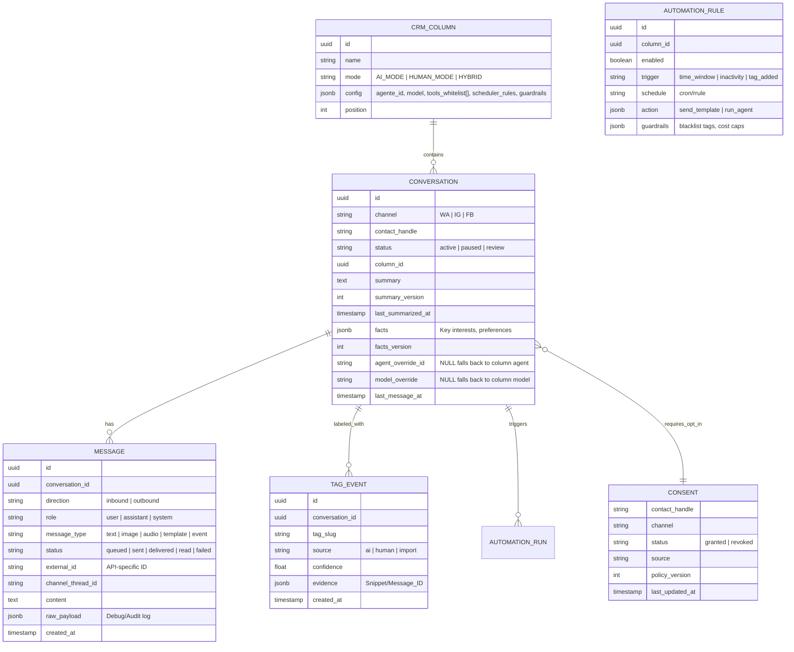

## 1. Modelo de Datos (Esquema Refinado)

### Tablas Principales (Supabase/PostgreSQL)



## 2. Motor de Enrutamiento (Dispatcher) & Operational Inheritance

El dispatcher no es solo un puente; es el ejecutor de la **política de columna**:

1. **Inheritance Logic**: Cuando una conversa entra en una columna, hereda:
   - `agente_id`: Define el prompt y personalidad.
   - `model`: Define la capacidad (GPT-4o, Gemini 3, etc).
   - `tools_whitelist`: Solo las herramientas permitidas en esta columna (ej: Ventas puede crear Checkouts, Soporte no).
2. **Fast Gates & Guardrails**:
   - Si `Column.mode == HUMAN_MODE` -> El dispatcher silencia la IA.
   - Guardrails: Si el clasificador detecta `UPSET_CUSTOMER`, el dispatcher puede forzar un `moveConversation` a la columna de Soporte Humano.

## 3. Configuración del "Cerebro de Columna" (JSON Spec)

Estructura de `crm_column.config`:
```json
{
  "agent_id": "sales_ara",
  "model": "gpt-4o",
  "tools": ["search_products", "create_checkout_link"],
  "automations": {
    "follow_up_hours": 6,
    "max_messages_per_day": 5
  },
  "guardrails": {
    "escalate_on_tags": ["UPSET_CUSTOMER", "LEGAL_THREAT"],
    "prohibited_topics": ["medical_claims"]
  }
}
```

## 3. Estrategia de "Smart Memory"

- **Actualización**: El `summary` se re-summariza cada N mensajes o después de 1 hora de inactividad.
- **Facts**: Los `key_facts` se extraen mediante una herramienta específica del agente que actualiza el JSON de la conversación.
- **Audit**: `raw_payload` en cada mensaje permite reconstruir exactamente qué envió el canal oficial (WA/Meta).

## 4. Próximos Pasos Técnicos

1. **Base de Datos**: Crear migraciones para `crm_columns`, `conversations` y `crm_messages`.
2. **Refactor Backend**: Crear `CRMController` y `CRMService` para manejar el enrutamiento.
3. **Frontend MVP**: Tablero Kanban básico utilizando `AdminSidekick` evolucionado o una nueva página `/admin/crm`.
